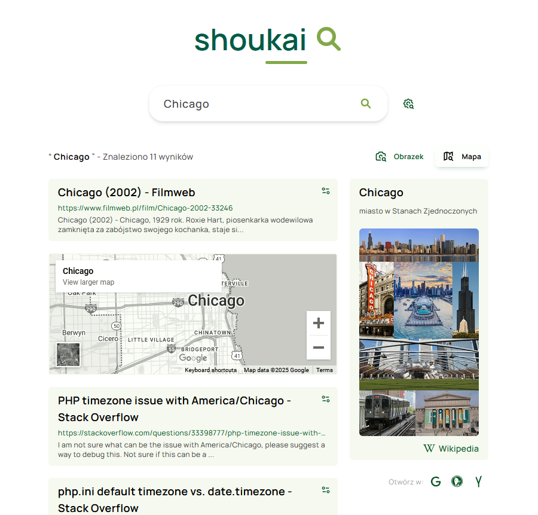

# shoukai - your personalized search 🔎

shoukai is not a search engine. It’s **a proof of concept** for an alternative approach to search. There are only a handful of true search engines on the market (with their own crawlers), and competing with them is a challenge. Each one has its own issues (and trust me, I've tested them all).

I created shoukai because I think there is room for improvement that could outperform what's currently available on the market.

## The idea behind personlized search

The unfortunate reality of today's internet is that we rely on just a few websites every day. For quick learning, you turn to Wikipedia. For movie information, IMDb is usually your go-to. And if you're a programmer, you're likely searching on Stack Overflow.

With shoukai, my goal is to get results from sources like DuckDuckGo whenever possible, but if Google does a better job of parsing the results, I’ll use it. For instance, when I search something with the word "array", I want Stack Overflow results more than 95% of the time, not a generic list with one stack overflow result, the page of anserws. If I search for 'memento,' I want to see a link to my local filmweb.pl as the first option (Google will find it, while Yandex will fail).

## How does shoukai work? [not yet]

The user installs the user script and selects their recipes, for example: Stack Overflow, Filmweb.pl, Genius.com, Spotify.com, and Google Maps. Each user can choose their own recipe, and in an ideal world, where this is not just a simple proof of concept, we would have a marker for recipes. These recipes would also be based on searches from sources like Stack Overflow and Filmweb directly—unfortunately, those local search engines are not the best at the moment and we often will need to realy on the few popular crawlers.

The only thing shoukai will try to do is determine which search engines to run in new tabs, parse only the first few results, and show them on the shoukai page.

## What do I want to achieve with this project?
Honestly, having better search tools that work for me is fine, but I can actually see how this idea could work as a viable future for the Internet search, you can steal it. ;)

## Current state
User scripts perform searches and update results for hardcoded recipes, of which only a few have been implemented. The application is public because I'm trying to use it to motivate myself to finish it.